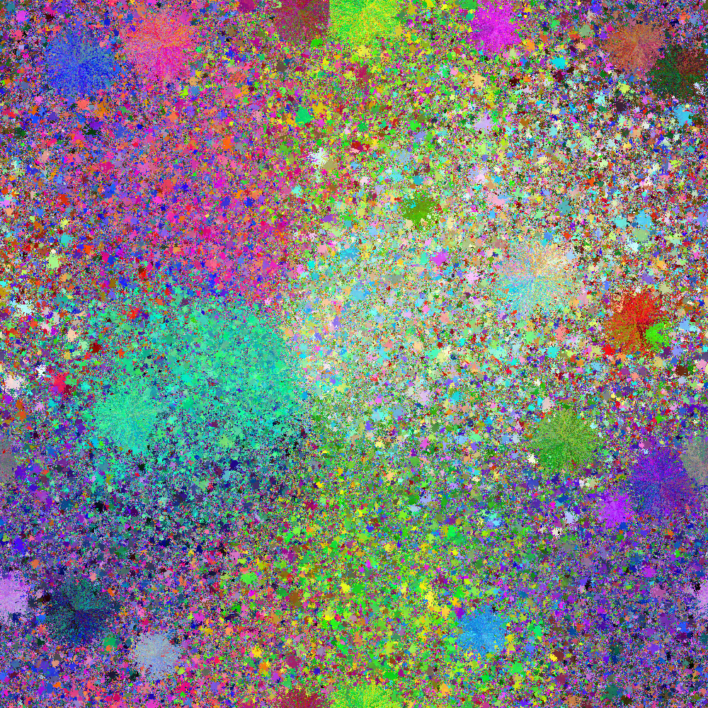

# sand-walk

Iterate over colors in a random order.
For each, find the most similar color, take a random walk, biased towards similar colors.
If we find an unoccupied location, place there.
If can't find a free slot in a reasonable number of steps,
sample some random unoccupied locations and choose the closest one
to the final location of the random walk.

